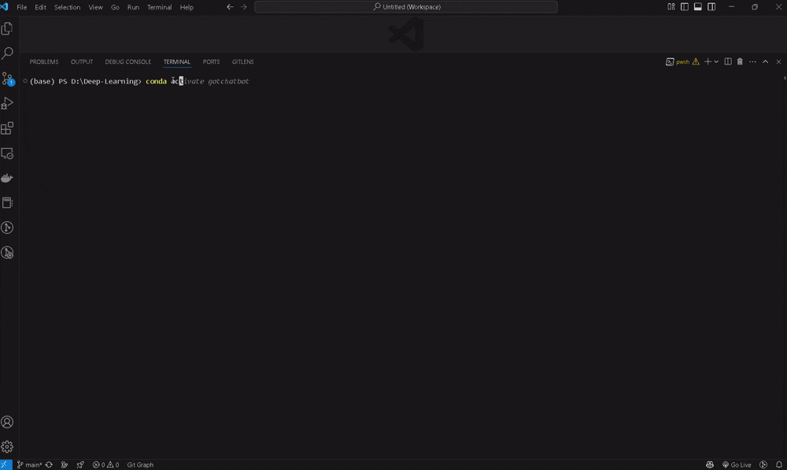

# 🐉 RAG: Game of Thrones Chatbot

## 📑 Table of Contents

- [🐉 RAG: Game of Thrones Chatbot](#-rag-game-of-thrones-chatbot)
  - [📑 Table of Contents](#-table-of-contents)
  - [🧠 Introduction](#-introduction)
  - [📚 Dataset](#-dataset)
  - [📁 Project Structure](#-project-structure)
  - [🧩 How It Works: RAG Pipeline](#-how-it-works-rag-pipeline)
    - [1. 🔧 Data Preparation](#1--data-preparation)
    - [2. 🔎 Query + Retrieval](#2--query--retrieval)
    - [3. 💬 Generation](#3--generation)
  - [🧠 Models \& Tooling](#-models--tooling)
  - [🧪 Evaluation with RAGAS](#-evaluation-with-ragas)
  - [✨ Example Queries](#-example-queries)
  - [🚀 Launch Instructions](#-launch-instructions)
  - [🧱 Docker Setup ](#-docker-setup)
    - [📋 Prerequisites](#-prerequisites)
    - [📦 Build Docker Image](#-build-docker-image)

---


---

## 🧠 Introduction

Welcome to my **Game of Thrones AI Chatbot**, powered by **RAG (Retrieval-Augmented Generation)**.  
This project combines my passion for the _Game of Thrones_ universe with what I’ve learned during a recent AI Apprenticeship.

The goal?  
To build a **lore-accurate question-answering system** that understands the complex world of Westeros — from the Red Keep to the Wall.

---

## 📚 Dataset

The chatbot’s knowledge base consists of the following five books by George R. R. Martin:

- _A Game of Thrones_
- _A Clash of Kings_
- _A Storm of Swords_
- _A Feast for Crows_
- _A Dance with Dragons_

> ⚠️ **Note:** Due to copyright restrictions, I cannot provide the raw text files or links to the books.

---

## 📁 Project Structure

<strong>📁 Project Directory Tree with Explanations</strong>

```plaintext
Game of Thrones Chatbot/
├── conf/                  # Config files for the entire pipeline
│   ├── embeddings/        # Embedding-specific settings
│   ├── preprocessing/     # Preprocessing (cleaning, deduplication) configs
│   ├── text_splitter/     # Chunking and sliding window logic configs
│   ├── evaluate.yaml      # Config for evaluation using RAGAS
│   ├── inference.yaml     # Inference parameters (LLM, retriever settings)
│   ├── logging.yaml       # Logging setup
│   └── training.yaml      # Any training-specific parameters
│
├── data/                  # Data storage folders
│   ├── answers/           # Ground truth or LLM-generated answers
│   ├── datasets/          # Game of Thrones Books
│   ├── embeddings/        # Vector Database
│   └── inference/         # Prompt templates
│
├── docker/                # Dockerfile and Docker-specific configs
│
├── images/                # Diagrams and logos used in the README
│
├── scripts/               # Shell scripts to automate tasks
│   ├── build_docker.sh    # Builds the Docker image
│   └── run_docker.sh      # Runs the Docker container
│
└── src/                   # Core Python source code
    ├── embeddings/        # Code to generate and manage embeddings
    ├── evaluation/        # RAGAS-based evaluation pipeline
    ├── frontend/          # Gradio interface components
    ├── inference/         # Retrieval + Generation logic
    ├── utils/             # Helper functions, logging, formatting
    ├── .env               # API keys and environment variables
    ├── app.py             # Main entry point (Gradio app)
    ├── evaluate.py        # Entry point to run evaluation
    ├── infer.py           # Script to run inference from command line
    └── train.py           # Script to run preprocessing and embedding
```

---

## 🧩 How It Works: RAG Pipeline

RAG stands for **Retrieval-Augmented Generation** — a framework that enhances LLMs by pairing them with external knowledge sources.


Here’s how the pipeline operates behind the scenes:

### 1. 🔧 Data Preparation

- The full book texts are **chunked** into overlapping sections.
- These chunks are converted into **dense embeddings** using a pre-trained model (e.g., OpenAI, HuggingFace).
- We store the chunks + metadata in a **FAISS** vector database for efficient similarity search.

### 2. 🔎 Query + Retrieval

- When a user submits a question (e.g., _"What happened at the Red Wedding?"_), it’s also embedded.
- The embedding is used to search the vector store and retrieve the top `k` most relevant passages.

### 3. 💬 Generation

- The **query + retrieved context** is injected into a prompt template.
- This template is passed to a **Large Language Model (LLM)** like GPT-4, Gemini, or Mixtral via LangChain.
- The model then generates an answer grounded in the books' content — not just general internet knowledge.

---

## 🧠 Models & Tooling

| Component     | Tool/Library                            | Required    |
| ------------- | --------------------------------------- | ----------- |
| Embeddings    |  | ✅          |
| Vector Store  |               | ✅          |
| LLM Interface |       | ✅          |
| Reranker      |             | 🔁 Optional |
| Observability |         | 🔁 Optional |
| Evaluation    |               | ✅          |
| Frontend      |             | ✅          |

> 🔁 Supports both single-query and multi-query retrieval  
> 🔄 Reranking enabled via `ContextualCompressionRetriever`

---

## 🧪 Evaluation with RAGAS

I also implemented an **automated evaluation pipeline** using [RAGAS](https://github.com/explodinggradients/ragas):

- ✅ **Faithfulness** – Is the answer backed by the retrieved context?
- ✅ **Answer Relevance** – Does the answer fully respond to the query?
- ✅ **Context Precision & Recall** – Are the retrieved documents relevant and sufficient?

Evaluations are reproducible and logged to **Langfuse**, enabling robust testing across LLMs, retrievers, and prompts.

---

## ✨ Example Queries

- _Who is Jon Snow's real mother?_
- _What are the three betrayals Daenerys was warned of?_
- _Describe the Red Wedding in detail._
- _What does the prophecy of Azor Ahai say?_

The chatbot provides **text-grounded answers**, referencing exact content from the books — not hallucinations.

---

## Live Demo / Screenshots

## 

## 🚀 Launch Instructions

To launch the Gradio interface locally:

```bash
python app.py
```

---

## 🚀 Setup Instructions (Non-Docker)

> Recommended for local development and debugging without Docker.

### 1. Clone the Repository

```bash
git clone https://github.com/YOUR_USERNAME/game-of-thrones-chatbot.git
cd game-of-thrones-chatbot
```

### 2. Create and Activate a Conda Environment

```bash
conda env create -f .\gotchatbot-conda-env.yaml -y
conda activate got-chatbot
```

### 3. Install Dependencies

```bash
pip install -r .\requirements.txt -r .\dev-requirements.txt
```

### 4. Add Environment Variables

Create a `.env` file inside the `src/` directory and include your API keys:

```env
OPENAI_API_KEY=your_openai_api_key
GEMINI_API_KEY=your_gemini_api_key
```

### 5. Run the Application

```bash
python src/app.py
```

This will launch the Gradio interface at:  
[Link](http://127.0.0.1:7860)

## 🧱 Docker Setup

To containerize and run the chatbot using Docker, follow these steps:

### 📋 Prerequisites

Before building the Docker image, ensure the following:

- Docker is installed on your system ([Docker Desktop](https://docs.docker.com/get-docker/))
- Your `.env` file (containing API keys and environment variables) exists under `src/.env`
- Able to run **bash script**:

  - **Linux/macOS:** Bash is usually pre-installed; you can run scripts directly in the terminal.
  - **Windows:**
    - Use **Git Bash** (install [Git for Windows](https://git-scm.com/download/win)) to run bash scripts.
    - Alternatively, use **Windows Subsystem for Linux (WSL)** if installed.

### 📦 Build Docker Image

Run this command from the project root to build the image:

```bash
bash scripts/build_docker.sh
```

After building the image, run the below to spin up a docker container:

```bash
bash scripts/run_docker.sh
```
